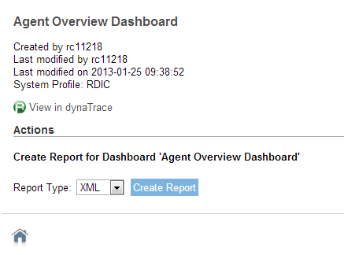
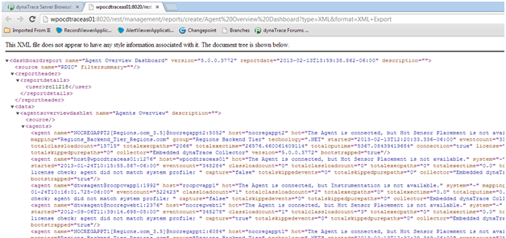
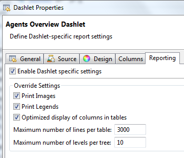
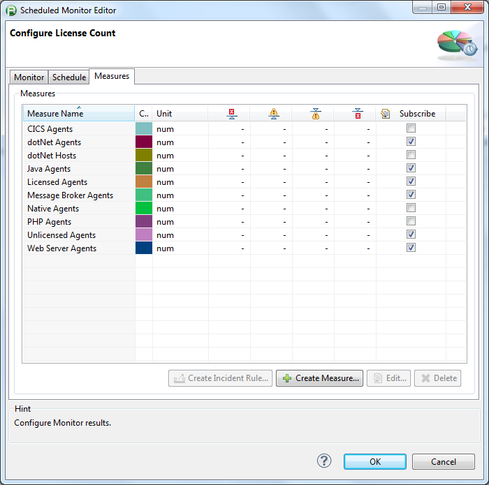
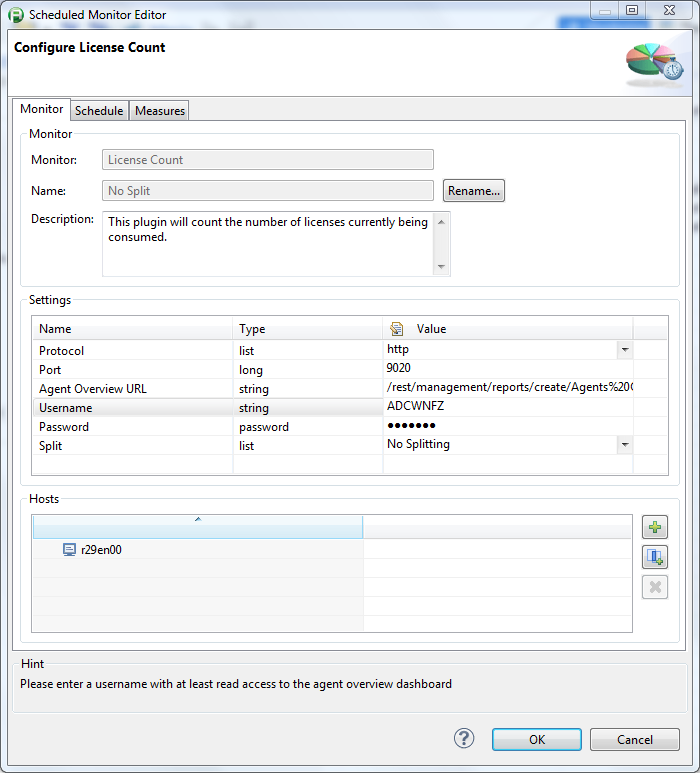
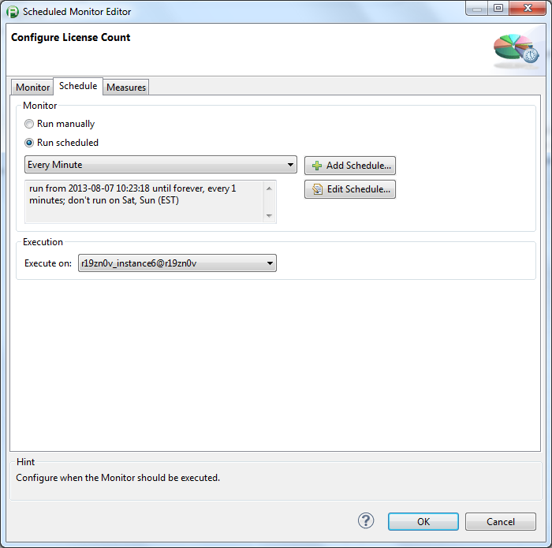
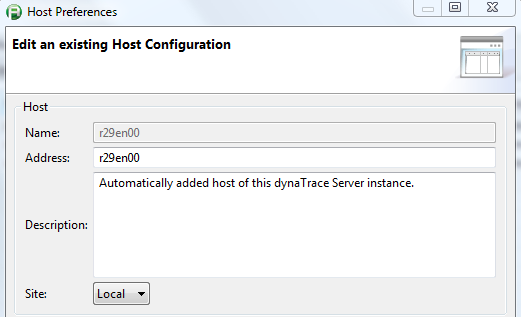
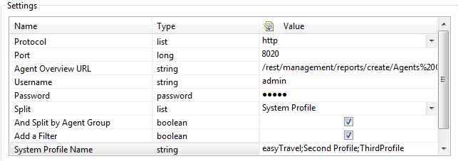
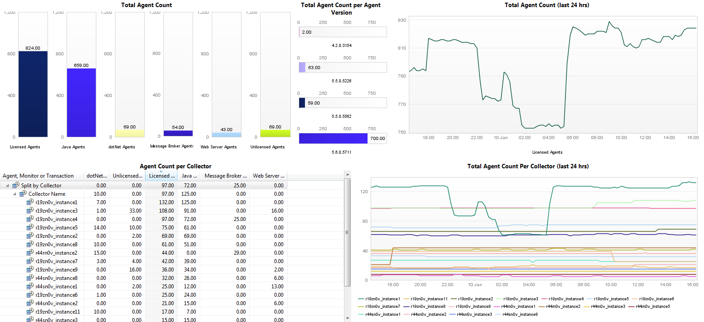

# License Count

## Overview

The license count plugin queries the agent overview to get the licenses being currently utilized by technology.

The plugin supports both HTTP and HTTPS.

The plugin uses dynaTrace REST Interface to query the following metrics:

  * Total licenses used 

  * Total agents not licensed 

  * Java agents 

  * .Net agents 

  * .Net Hosts 

  * Web Server agents 

  * Message Broker agents 

  * Native agents 

  * PHP agents 

  * CICS agents 

The plugin can filter or dynamically split on the following items:

  * System Profile 

  * Collector 

  * System Profile/Agent Group 

  * Host 

  * Agent Version 

## Plugin Details

| Name | License Count
| :--- | :---
| Author | Shaun Gautz ([shaun.gautz@compuware.com](mailto:shaun.gautz@compuware.com))
| | Michael Beemer ([michael.beemer@compuware.com](mailto:michael.beemer@compuware.com))
| Supported dynaTrace Versions | >= 5.5
| License | [dynaTrace BSD](dynaTraceBSD.txt)
| Support | [Not Supported](https://community.compuwareapm.com/community/display/DL/Support+Levels#SupportLevels-Community))
| Release History | 2014-04-21 Added support for multiple filters, dynamic splits for System Profile/Agent Group and enhanced 'finer' level of logging
|| 2014-01-28 Added support for HTTPS
|| 2014-01-10 Dynamic splits and added agent types
|| 2013-03-28 Split by System Profile and bug fixes  
|| 2013-02-13 Initial Release
| Download |[com.dynatrace.license.count_1.1.0.jar](com.dynatrace.license.count_1.1.0.jar)
|| [com.dynatrace.license.count_1.5.0.jar](com.dynatrace.license.count_1.5.0.jar)
|| [com.dynatrace.license.count_1.6.0.jar](com.dynatrace.license.count_1.6.0.jar)
|| [com.dynatrace.license.count_1.7.0.jar](com.dynatrace.license.count_1.7.0.jar)
|| [System Health - License Count.dashboard.xml](System_Health__License_Count.dashboard.xml)

## Configuration

This plugin requires that you first save the Agent Overview as a dashboard on the dynaTrace server. Make sure the maximum number of lines per table is larger than the number of agents, or the xml will
be cutoff. Once the dashboard is saved, use a web browser to navigate to the <http://server_name:8020>, by default, or <https://server_name:8021,> if you are using HTTPS. Once at the home page,
navigate to View Dashboard & Reports -> Agent Overview Dashboard (or whatever you named it) -> Details -> Report Type is XML -> Create Report. Use this URL on the Monitor tab. **Starting in version
1.6, the Monitor screen has the URL split out.** **One box is for protocol, one is for port, and another is for the rest of the URL** (/rest/...).

Once you have the plugin installed and created, then you can create a new monitor, as shown in the following screenshots.

The plugin now uses the host you selected for the monitor. It uses the Address block of that host. You may need to change this, if it doesn't work by default.

Use the following Monitor names to work with the dashboard:

You may add a filter, if you only want to see one System Profile or Collector. **Starting in version 1.7, you can use multiple filters separated by a semicolon**,** such as "easyTravel;Second
Profile;ThirdProfile". **

## Results

The following screenshot shows a dashboard displaying some of the measures queried by the monitor:

## Things to consider

  1. Since it's a measure, it polls on a schedule instead of when the agent count changes 

  2. The filtering does not use regex and is case sensitive 

  3. The count for .Net hosts is based off the number of servers not CLRs. There is a separate value for Net Agents 

  4. Requires a username and password with at least read access to the REST interface 

  5. Not all of the agent types are included here. If you have an agent you would like added, add a comment below 

  6. If you have many hosts, splitting by host may take several minutes to get all the data 

## Updates

The new 1.7.0 update adds support for multiple filters, separated by a semicolon. It adds splitting by System Profile/Agent Group and adds enhanced 'finer' level of logging.

The new 1.6.0 update adds support for a dT server running over HTTPS.

The new 1.5.0 update adds the option to split dynamically on system profile, collector name, agent version, and host name. You can still filter for one item, or you can leave the filter blank and the
monitor will pull all of the items that have a license count. Several agents were also added to the available metrics.

Legacy

The new 1.1.0 update adds an option to split by a system profile name. If you are going to use this feature, it might be a good idea to name the license count measure based on the system profile to
avoid confusion. Also, keep in mind that the system profile name must match exactly or the count will be zero. Special thanks to Rajesh for the feedback on this.

